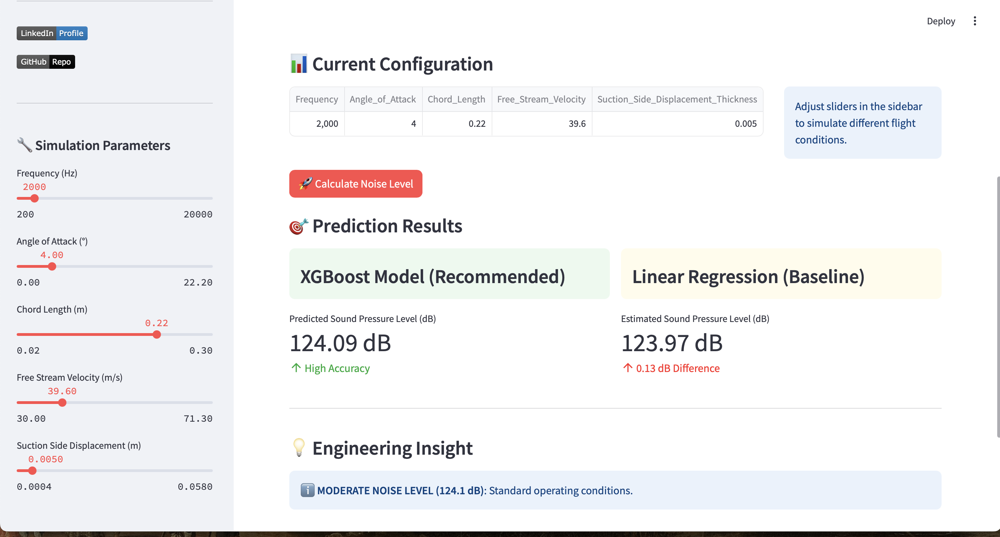

# ✈ Predictive Modeling of Airfoil Self-Noise


## 📌 Project Overview
This project aims to predict the **aerodynamic noise (Sound Pressure Level)** generated by airfoils using **NASA's NACA 0012 Wind Tunnel Dataset**. 

Understanding airfoil noise is critical for the aerospace and wind energy industries. This repository demonstrates a complete **End-to-End ML Pipeline**, evolving from a baseline Linear Regression model to a high-performance **XGBoost Regressor**, culminating in an interactive **Streamlit Web Application**.

---

## 🚀 Key Features
1.  **Physics-Aware Data Pipeline:** Automated validation of aerodynamic constraints (e.g., negative velocity checks).
2.  **Model Benchmarking:** Comparison between Linear Regression (Baseline) and XGBoost (Advanced).
3.  **Hyperparameter Tuning:** Grid Search optimization for maximum accuracy.
4.  **Interactive Dashboard:** A web-based simulator for real-time predictions.
5.  **Robust Engineering:** Includes unit tests and modular code structure.

---
## 💻 Streamlit Dashboard Preview

*The project includes an interactive dashboard allowing users to simulate flight conditions and get real-time noise predictions.*



## 📊 Model Performance Results

The transition from a linear model to a gradient boosting tree (XGBoost) resulted in a massive performance leap, confirming the non-linear nature of aerodynamic acoustics.

| Metric | Linear Regression (Baseline) | XGBoost (Final Model) | Improvement |
| :--- | :---: | :---: | :---: |
| **R² Score** | 0.5583 | **0.9620** | 🚀 **+72.3%** |
| **MAE** (Mean Absolute Error) | 3.67 dB | **0.89 dB** | 📉 **-75.7%** |
| **RMSE** (Root Mean Sq. Error)| 4.70 dB | **1.38 dB** | 📉 **-70.6%** |

> **Engineering Insight:** The Baseline model failed to capture the complex interaction between *Angle of Attack* and *Suction Side Displacement*. The XGBoost model successfully modeled these non-linearities, reducing the error margin to less than **1 dB**.

## 📂 Project Structure

```text
Airfoil_Prediction_Project/
│
├── data/
│   ├── raw/               # Original NASA dataset
│   └── processed/         # Cleaned data
│
├── src/                   # Source Code (Core Logic)
│   ├── data_loader.py     # Data ingestion & Physics validation
│   ├── model_trainer.py   # Training pipeline
│   └── utils.py           # Evaluation metrics
│
├── tests/                 # Unit Tests
│   └── test_model.py      # Automated model checks
│
├── notebooks/             # Jupyter Notebooks for Analysis
│   ├── 1_EDA_and_Physics.ipynb
│   └── 2_Model_Comparison.ipynb
│
├── app/
│   └── app.py             # Streamlit Dashboard code
│
├── main.py                # Main execution script
└── requirements.txt       # Dependencies
```
🛠️ Installation & Usage
### 1. Clone & Install

```Bash
git clone [https://github.com/your-username/Airfoil_Prediction_Project.git](https://github.com/your-username/Airfoil_Prediction_Project.git)
cd Airfoil_Prediction_Project
pip install -r requirements.txt
```
### 2. Run Pipeline (Train Models)

```Bash
python main.py
```
### 3. Run Unit Tests (Quality Assurance)

```Bash
pytest
```
### 4. Launch Dashboard

```Bash
streamlit run app/app.py
```

