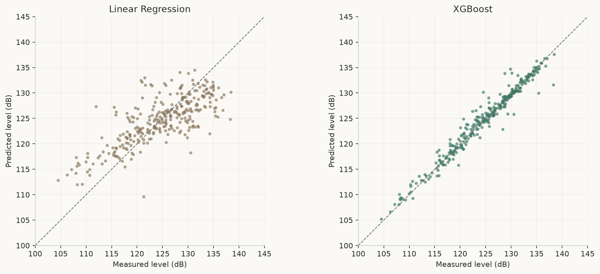
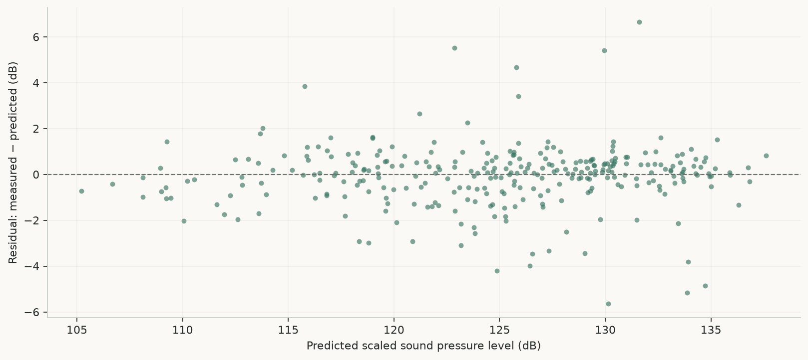

# NACA 0012 Airfoil Noise Prediction

Predicting scaled aerodynamic sound pressure level from five experimental inputs using a linear regression baseline and tuned XGBoost. The repository includes the dataset, analysis notebooks, saved models, a modular Python training workflow, a Streamlit application, and a static technical showcase.

**Verified XGBoost holdout:** R² **0.9620** · RMSE **1.380 dB** · MAE **0.899 dB** across **301 observations**.

[Project analysis](docs/PROJECT_ANALYSIS.md) · [Evaluation evidence](docs/assets/metrics.json) · [Deployment guide](docs/GITHUB_PAGES_DEPLOYMENT.md)

## Overview

Airfoil self-noise depends on geometry, flow conditions and frequency. This project compares ordinary least squares with gradient-boosted trees to estimate the acoustic response recorded in wind-tunnel experiments. The application demonstrates inference with the saved estimators; the website explains the methodology, results and limitations.

The results describe a random holdout within this dataset. They do not establish generalization to other airfoils or unseen experimental configurations, nor do they measure aerodynamic stress, efficiency or operational safety.

## Dataset

The [UCI Airfoil Self-Noise dataset](https://archive.ics.uci.edu/dataset/291/airfoil+self+noise) contains NASA wind-tunnel measurements of NACA 0012 airfoils. The local data has **1,503 observations**, five predictors, one target, no missing values and no duplicate rows. Span and observer position were fixed in the experiments.

| Variable | Repository field | Unit | Observed range |
| --- | --- | --- | --- |
| Frequency | `Frequency` | Hz | 200–20,000 |
| Angle of attack | `Angle_of_Attack` | degrees | 0–22.2 |
| Chord length | `Chord_Length` | m | 0.0254–0.3048 |
| Free-stream velocity | `Free_Stream_Velocity` | m/s | 31.7–71.3 |
| Suction-side displacement thickness | `Suction_Side_Displacement_Thickness` | m | 0.000400682–0.0584113 |
| **Target: scaled sound pressure level** | `Sound_Pressure_Level` | dB | 103.380–140.987 |

`data/raw/airfoil_self_noise.csv` is **tab-separated and headerless**, despite its extension. The processed CSV adds column names and has identical numeric values. The loader prints basic physical consistency warnings; it does not reject or remove invalid rows.

Citation: Brooks, T., Pope, D., & Marcolini, M. (1989). *Airfoil Self-Noise* [Dataset]. UCI Machine Learning Repository. [doi:10.24432/C5VW2C](https://doi.org/10.24432/C5VW2C).

## Machine Learning Pipeline

1. Load data and perform basic physical checks; inspect distributions and correlations in the EDA notebook.
2. Split randomly into **1,202 training / 301 test rows**, using `test_size=0.2` and `random_state=42`.
3. Fit `StandardScaler` on training predictors and transform both subsets.
4. Fit and evaluate the linear regression baseline.
5. If baseline R² is below 0.85, tune XGBoost using five-fold `GridSearchCV`, scored by negative mean squared error.
6. Evaluate on the holdout and save estimators and scaler with Joblib.
7. Use the saved scaler and models for Streamlit inference.

The search covers **54 parameter combinations / 270 CV fits** plus the final refit. Scaling is fitted before CV in the existing implementation; fitting preprocessing separately inside each fold is future work. The holdout is excluded from scaler fitting.

## Models

| Model | Role | Configuration |
| --- | --- | --- |
| Linear Regression | Baseline | Ordinary least squares on standardized predictors |
| XGBoost Regressor | Final estimator | 300 trees, depth 7, learning rate 0.1, subsample 0.8, seed 42; squared-error objective |

Search grid: `n_estimators=[100,200,300]`, `learning_rate=[0.01,0.1,0.2]`, `max_depth=[3,5,7]`, `subsample=[0.8,1.0]`.

The saved model’s normalized average gain ranks displacement thickness (36.0%), chord length (29.8%), frequency (18.9%), angle of attack (7.8%) and velocity (7.4%). These are model-specific importance scores, not causal effects or effect directions.

## Results

Metrics below were recomputed from the **unchanged saved artifacts** on the reconstructed 301-row holdout. The scaler’s mean, variance and sample count match the reconstructed training data. Full-precision metrics, split indices, package versions and SHA-256 hashes are stored in [metrics.json](docs/assets/metrics.json).

| Model | R² | MAE (dB) | RMSE (dB) |
| --- | ---: | ---: | ---: |
| Linear Regression | 0.5583 | 3.672 | 4.704 |
| **XGBoost** | **0.9620** | **0.899** | **1.380** |

XGBoost reduces RMSE by approximately **70.7%** relative to the baseline on this split. MAE is an average discrepancy, not a guaranteed error bound. The original README’s 0.89 dB MAE was imprecise: the verified value is 0.899117 dB, which rounds to 0.90 dB at two decimals.





**Notebook context:** `2_Model_Comparison.ipynb` evaluates the entire dataset, including training rows. Its historical plots must not be read as holdout evaluation. The website uses regenerated holdout figures. Original notebooks are preserved; the [analysis](docs/PROJECT_ANALYSIS.md) documents interpretation errors in their text.

## Project Architecture

```text
NACA-0012-Airfoil-Noise-Prediction/
├── app/app.py                    # Streamlit input and inference UI
├── assets/dashboard_preview.png  # Historical application screenshot
├── data/
│   ├── raw/                      # Original local observations
│   └── processed/                # Same values with named columns
├── models/trained_models/        # Two estimators, scaler, legacy baseline copy
├── notebooks/                    # EDA and full-data comparison
├── src/
│   ├── data_loader.py            # Loading and physical warnings
│   ├── model_trainer.py          # Split, scale, train, tune, persist
│   └── utils.py                  # Evaluation metrics
├── tests/                        # Artifact and inference verification
├── scripts/                      # Figure generation and static validation
├── docs/                         # Self-contained GitHub Pages website
├── main.py                       # Training entry point
├── requirements.txt              # General project dependencies
└── requirements-artifacts.txt    # Artifact-compatible estimator versions
```

## Installation

**Python 3.12 is recommended** for the verified artifact environment. The original notebooks record Python 3.9.25, but the full original training environment is not available. The artifact requirements match saved scikit-learn 1.6.1 and XGBoost 3.0.2; they are not a complete dependency lockfile.

```bash
git clone https://github.com/MEK-0/NACA-0012-Airfoil-Noise-Prediction.git
cd NACA-0012-Airfoil-Noise-Prediction
python3.12 -m venv .venv
source .venv/bin/activate
python -m pip install -r requirements-artifacts.txt
```

On Windows, use `py -3.12 -m venv .venv` and `.venv\Scripts\Activate.ps1` in PowerShell. On macOS, XGBoost may also need OpenMP:

```bash
brew install libomp
```

Only load trusted Joblib/pickle artifacts. The checked-in saved models are sufficient to run the app; no training is needed.

## Usage

Run commands from the repository root after activating the environment.

Regenerate the showcase metrics and figures **without retraining or overwriting models**:

```bash
python scripts/generate_showcase_assets.py
```

To intentionally rerun the original training workflow:

```bash
python main.py
```

Training performs a grid search and **overwrites the processed CSV, model artifacts and scaler**. It may take time and does not guarantee identical results across dependency versions or hardware. Preserve existing artifacts before experimenting. This portfolio preparation did not retrain them.

To inspect notebooks, install Jupyter separately (`python -m pip install jupyterlab`), then run `cd notebooks` followed by `jupyter lab`; their relative paths assume that directory.

## Streamlit Application

```bash
streamlit run app/app.py
```

The five sliders configure an input row. The app applies the saved scaler and shows both XGBoost and linear regression estimates. Artifact loading is relative to the application file, so it also works when launched using an absolute script path.


This screenshot records the original UI and predates the correction of its unsupported physical interpretation text. Some slider limits extend beyond observed data, and independent slider settings can form unseen combinations. The app is an exploratory demonstration, not a validated operating-condition advisory tool. External images in the Python app require network access.

**No live Streamlit deployment URL is recorded in the repository.** The GitHub Pages page provides an explicitly labeled interface preview with no calculated or simulated prediction.

## Testing

```bash
python -m pytest -q
python -m compileall -q app src scripts tests main.py
python scripts/check_docs.py
```

Tests cover artifact loading, output shape, a broad numerical sanity bound and saved-model holdout regression. The static checker validates local asset paths, fragments, preview labels and result consistency. See [validation notes](docs/VALIDATION.md) for execution results and remaining manual browser checks.

## GitHub Pages

The website uses plain HTML, CSS and JavaScript in `docs/`. **No Node.js, build pipeline, server or Python dependency is needed to serve it.** Open `docs/index.html` directly, or preview with:

```bash
python -m http.server 8000 --directory docs
```

Visit `http://127.0.0.1:8000/` for local preview. This local URL is not a deployment URL.

After pushing the commits to `main`, configure **Settings → Pages → Deploy from a branch → main → /docs → Save**. Follow the [deployment and troubleshooting guide](docs/GITHUB_PAGES_DEPLOYMENT.md).

Expected public URL (deployment **not confirmed**):

**https://mek-0.github.io/NACA-0012-Airfoil-Noise-Prediction/**

## Future Work

- Evaluate grouped splits to measure transfer across experimental conditions.
- Fit preprocessing inside CV folds and retain tuning results and split manifests.
- Add external validation and uncertainty estimates.
- Investigate feature effects with SHAP or permutation importance.
- Package a versioned inference API and deploy the Python application separately.
- Expand invalid-input tests and physical validation.
- Export a portable model format and record a complete training environment.

## License

The repository currently has **no declared source-code license**. No license has been inferred or added on the owner’s behalf.

The dataset is separately listed by [UCI](https://archive.ics.uci.edu/dataset/291/airfoil+self+noise) under **Creative Commons Attribution 4.0 International (CC BY 4.0)**; retain its attribution when redistributing or adapting it.
